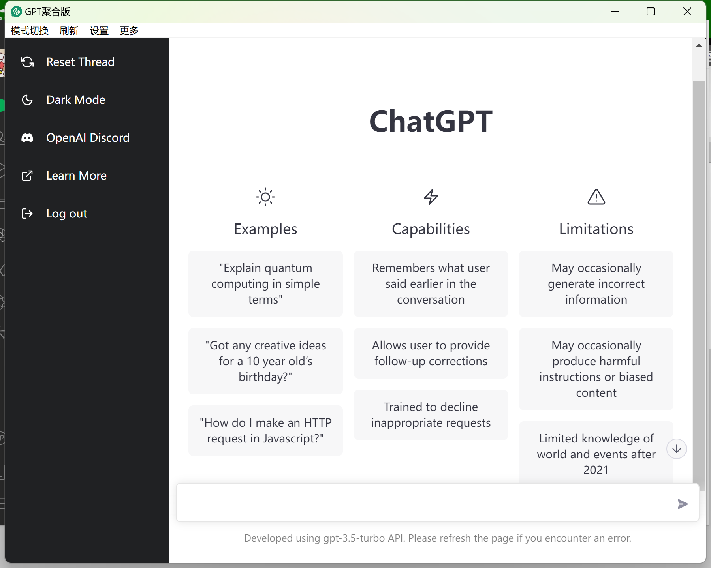
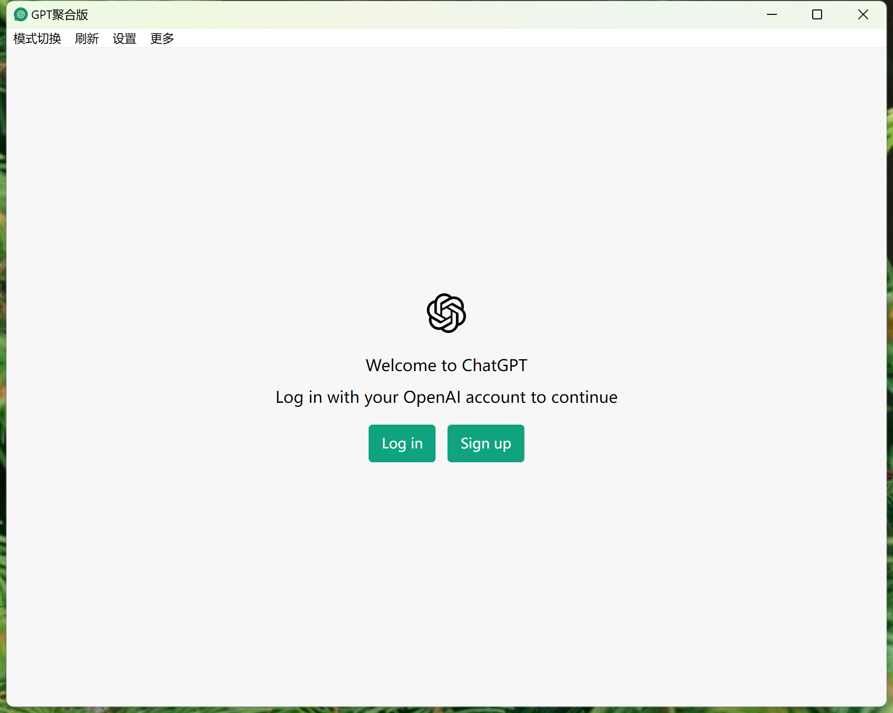

<div align="center">
    
    <h1>OneGPT - GPT聚合版</h1>
    <div>
    <a target="_blank" href="https://github.com/1595901624/gpt-aggregated-edition/releases">
        
    </a>
    
<!-- </img> -->
    
    </div>
    
    
    
    <h4>聚合ChatGPT官方版、ChatGPT免费版、文心一言、POE、chat chat等多个平台。</h4>
</div>
  
如果您有好的建议或者意见，可以通过提 issue 来告诉我。**如果要求在合理范围之内，你的想法我来帮你实现。**

**请勿相信任何平台内的任何广告，平台内的广告均属于第三方广告，与我无关。**

如果您 **不希望我将您的网站聚合到软件内** 或者 **您需要将您的网站聚合到软件内** 。可以通过邮件 <haoyu3@163.com> 联系我。

**首次使用时切换平台会很慢，请耐心等待**

**`Gitee`仅仅是为了国内访问方便而创建的镜像，如果提 issue 优先 Github**

#### 截图样例
<div>





</div>


#### 聚合的平台

##### ChatGPT

* ChatGPT官方版  
需要注册账号、需要登录官方账号(不建议非美国地区访问)

* ChatGPT免费版  
无需注册账号、无需登录账号、稳定极速(部分国家和地区无法正常访问)

* ChatGPT限额版——[ChatChat](https://chat.okis.dev/zh-CN?mode=chat)(推荐使用)
这是一个ChatGPT镜像。无需注册账号、无需登录账号、稳定极速、每日限额，国内可正常访问。

* ChatGPT免费线路2——[BAI Chat](https://chatbot.theb.ai/#/chat/1002)(推荐使用)
这是一个ChatGPT镜像。无需注册账号、无需登录账号、稳定极速(部分国家和地区无法正常访问)

* ChatGPT免费线路3——[ChatGPT-35-Turbo.com](https://chatgpt-35-turbo.com/)
这是一个ChatGPT镜像。无需注册账号、无需登录账号、稳定极速(部分国家和地区无法正常访问)

##### POE
需要注册账户、需要登录账号、集合Sage（免费）、ChatGPT4（付费）、ChatGPT（付费）、Clude（免费）、Clude+（付费）、DragonFly（免费）(部分国家和地区无法正常访问)

* Claude：更擅长创意写作任务，但更容易拒绝回答问题。
* Sage 和 ChatGPT：更擅长英语以外的语言，更擅长与编程相关的任务。
* Dragonfly 响应较短，并且在输入中给出示例时更容易让 Dragonfly 遵循说明。

##### 文心一言
需要有体验资格且必须登录百度账号

##### 通义千问
需要有体验资格且必须登录阿里账号

##### Bard
需有体验资格且必须登录 Google 账号(部分国家和地区无法正常访问)

##### New Bing
需要有体验资格且必须登录 bing 账号(部分国家和地区无法正常访问)

##### 文心一格
必须登录百度账号

#### 功能介绍

软件是使用 Rust + tauri 构建的。

- [x] 多平台切换
- [x] 窗口模式和任务栏模式切换
- [x] 跨平台（Windows、Mac、Linux）
- [x] 聚合更多平台
- [x] 文心一言定制化功能
- [x] 支持自定义平台（来自[ GPTFusion ](https://github.com/lpdswing/chatgpt)的灵感）
- [x] 支持导出自定义平台配置文件
- [x] QQ 模式（来自[ ESwordCn ](https://github.com/ESwordCn)的建议）
- [ ] 自定义脚本支持
- [ ] 更多功能敬请期待...

#### 下载
请前往 Release 页面下载最新版本。下载时建议选择带有 `Latest` 标签或者 `最新版` 标签的版本，带有 `Pre-release` 标签和 `预览版本` 标签的版本是测试版本。  

[Gitee](https://gitee.com/haoyu3/gpt-aggregated-edition/releases)  

[Github](https://github.com/1595901624/gpt-aggregated-edition/releases)

注：Windows、Mac、Linux平台先均已支持。Linux平台自 `0.4.0` 版本开始支持。

#### 反馈及建议

* 通过《Rust学习日记》公众号内小窗反馈
* Github 提 issue
* Gitee 提 issue

#### 感谢
* 感谢 [lpdswing](https://github.com/lpdswing) 提出的建议。
* 感谢 [ ESwordCn ](https://github.com/ESwordCn) 提出 `QQ` 侧边栏的建议 
* 感谢所有各位搭建免费 GPT 镜像的研发工程师

#### 下载安装
- Windows  
`Windows (32位架构)`: 请下载 `OneGPT_版本号_x86_zh-CN.msi（推荐）` 或者 `OneGPT_版本号_x86-setup.exe`   
`Windows (64位架构)`: 请下载 `OneGPT_版本号_amd64_zh-CN.msi（推荐）` 或者 `OneGPT_版本号_amd64-setup.exe`   
`Windows (arm64架构 MS SQ/MS SQ2/高通处理器)`: 请下载  `OneGPT_版本号_arm64-setup.exe`   
- Mac  
`MacOs (Intel芯片)`: 请下载 `OneGPT_版本号_x64.dmg`  
`MacOs (Apple芯片 M1/M2系列等)`: 请下载 `OneGPT_版本号_aarch64.dmg`   
- Linux  
`Linux (仅支持64位架构)`: 请下载 `one-gpt_版本号_amd64.AppImage` 或者 `one-gpt_版本号_amd64.deb`   

#### 《Rust学习日记》公众号


#### 捐赠

| Paypal | 微信 | 支付宝 |
| --- | --- | --- |
| [**`Paypal`**](https://www.paypal.com/paypalme/haoyu94) |  |  |

#### 二次开发
```shell
pnpm install
pnpm tauri dev
pnpm tauri build
```

## Star History

[](https://star-history.com/#1595901624/gpt-aggregated-edition&Timeline)

